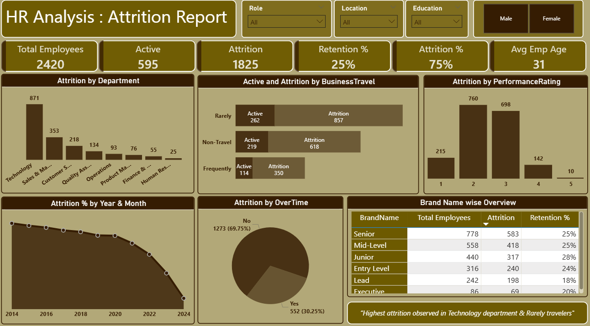

# HR Attrition Analysis Dashboard (Power BI)
  HR Attrition Analysis dashboard built in Power BI to analyze employee turnover, retention trends, and key factors such as department, business travel, performance rating, and experience level.

## Project Overview
This project focuses on analyzing employee attrition patterns using an interactive **Power BI dashboard**.  
The goal is to identify key factors contributing to employee turnover and provide data-driven insights that can help HR teams improve retention strategies.

---

## Key Objectives
- Understand overall attrition and retention trends  
- Identify departments with the highest attrition  
- Analyze the impact of business travel, performance rating, and experience level on attrition  
- Track attrition trends over time  

---

## Dashboard Highlights
- **Total Employees, Active Employees & Attrition Count**
- **Attrition % and Retention % KPIs**
- **Attrition by Department**
- **Active vs Attrition by Business Travel**
- **Attrition by Performance Rating**
- **Year & Month-wise Attrition Trend**
- **Employee Level wise Overview (Junior, Mid-Level, Senior, etc.)**
- **Gender, Role, Location & Education slicers for dynamic analysis**

---

## Dashboard Preview

---

##  Key Insights
- Highest attrition observed in the **Technology department**
- Employees who **rarely travel** show higher attrition compared to frequent travelers
- Attrition rate is significantly higher among **lower performance ratings**
- Overall **attrition rate ~75%**, indicating strong need for retention strategies
- Junior and Mid-Level employees contribute the most to total attrition

---

##  Tools & Technologies
- **Power BI**
- **DAX**
- **Data Modeling**
- **Data Cleaning & Transformation**

---

## Files Included
- `dashboard2.png` – Dashboard preview image  
- `Mobile dashboard.pbix` – Power BI dashboard file  
- `README.md` – Project documentation  

---

##  Use Case
This dashboard can help:
- HR teams monitor attrition patterns  
- Management take proactive retention actions  
- Organizations improve workforce planning and employee engagement  

---

## 👩‍💻 Author
**Rinku**  

